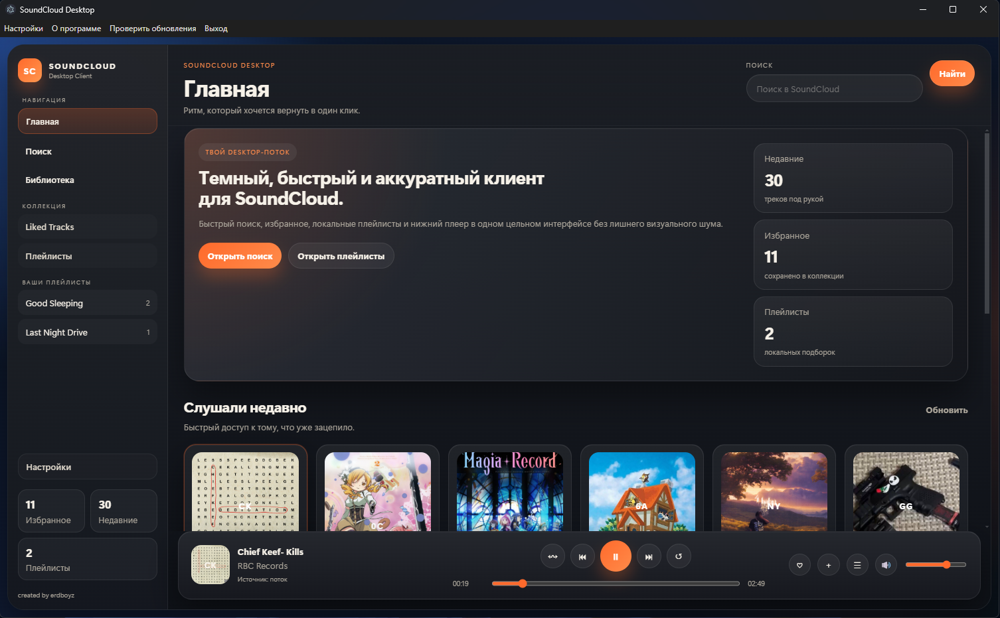
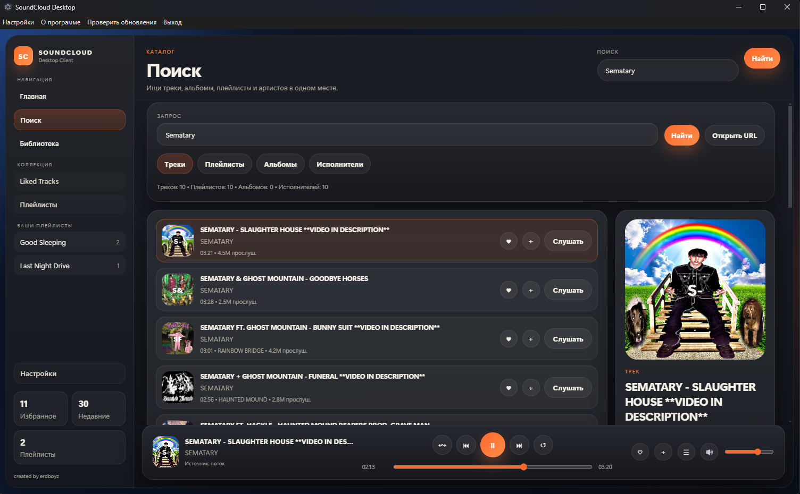

# SoundCloud Desktop Client

Desktop-клиент для SoundCloud на Electron.

Проект уже умеет искать треки, плейлисты, альбомы и артистов, открывать профили и подборки внутри клиента, хранить локальную библиотеку и воспроизводить музыку через нижний плеер.

## Возможности

- поиск по трекам, плейлистам, альбомам и исполнителям;
- открытие трека или ссылки SoundCloud по URL;
- профили артистов, альбомы и плейлисты внутри клиента;
- избранное;
- локальные плейлисты;
- история прослушивания;
- нижний плеер и полноэкранный режим;
- очередь воспроизведения;
- скачивание трека через `yt-dlp`;
- подключение внешнего backend-сервера через настройки.

## Интерфейс





## Стек

- Electron
- better-sqlite3
- axios
- yt-dlp-wrap

## Запуск

```bash
npm install
npm start
```

## Что нужно для воспроизведения

Для стриминга и скачивания должен быть установлен `yt-dlp`.

Проверка:

```bash
yt-dlp --version
```

Если команда не находится, установите `yt-dlp` и добавьте его в `PATH`.

ВАЖНО: при упаковке electron проекта в exe файл создайте vendor/yt-dlp.exe директорию.

## Подключение сервера

Клиент умеет работать через внешний backend-сервер. Это нужно для релизной версии, чтобы не хранить приватные SoundCloud ключи внутри приложения.

В приложении для этого есть страница `Настройки`, где можно указать:

- адрес сервера;
- ключ доступа, если сервер защищен.

После сохранения клиент будет использовать подключенный сервер для поиска, открытия профилей артистов, альбомов и плейлистов.

Если сервер не указан, приложение работает в обычном режиме, доступном в текущей сборке.

## Где хранятся пользовательские данные

Избранное, локальные плейлисты, история и настройки не лежат внутри `.exe`.

Они сохраняются в пользовательской папке Electron через `app.getPath('userData')`. Это значит:

- у каждого пользователя будет своя отдельная библиотека;
- ваши личные лайки, плейлисты и история не должны попадать в релиз;
- перед упаковкой приложения не нужно включать локальные файлы разработки вроде временных токенов и конфигов.

Основные локальные данные клиента:

- `soundcloud_client.db` — избранное, история, локальные плейлисты;
- `soundcloud-client-settings.json` — настройки подключения;
- `soundcloud-app-token.json` — локальный кэш токена, если используется соответствующий режим.

## Структура проекта

```text
src/
  main/
    main.js
    preload.js
    db/database.js
    services/soundcloud-service.js
  renderer/
    index.html
    styles.css
    renderer.js
```

## Репозиторий

[GitHub](https://github.com/erdboyz/SoundCloud-Desktop-Client)
